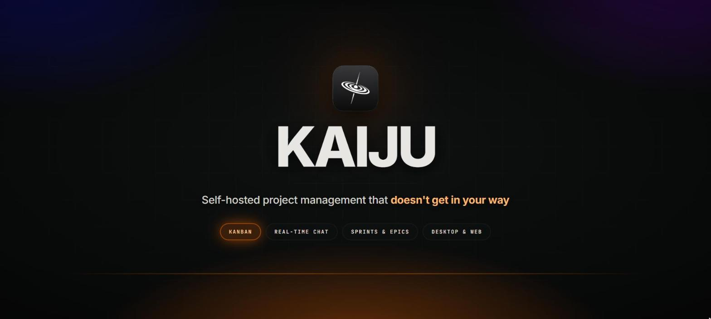
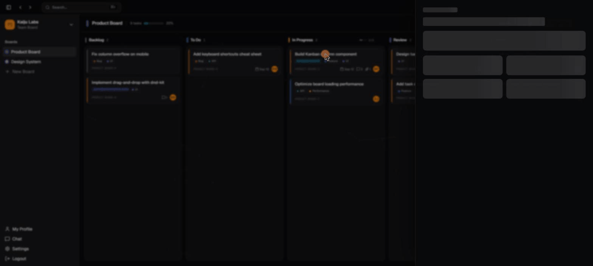
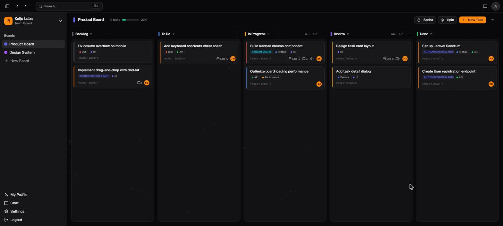
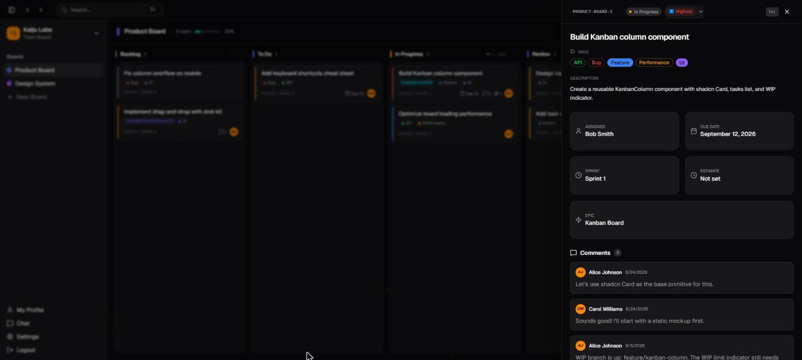
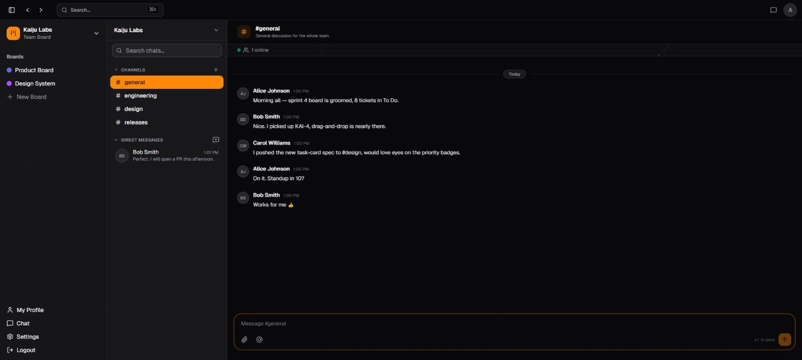
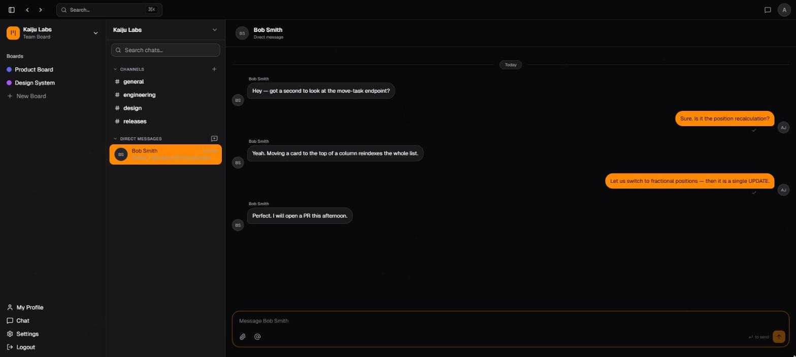
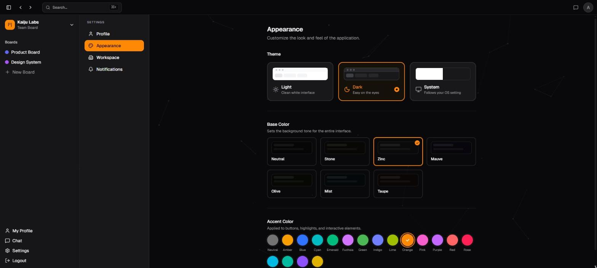
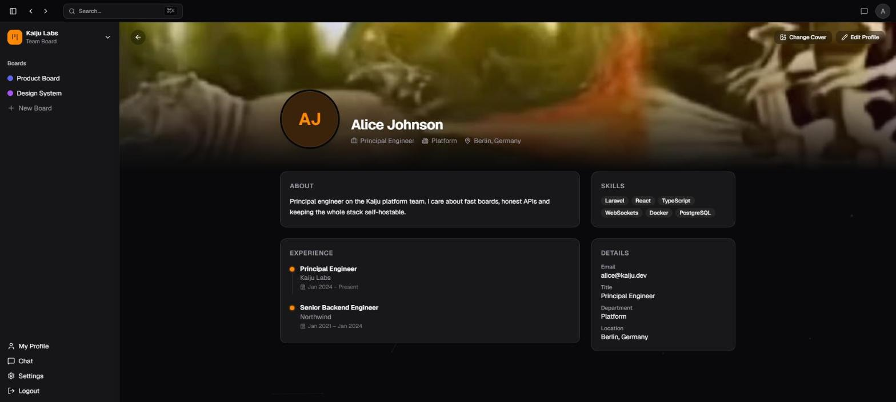
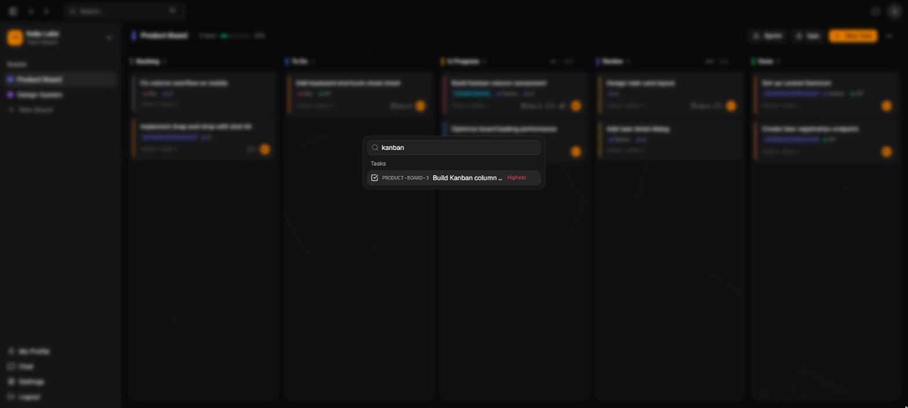
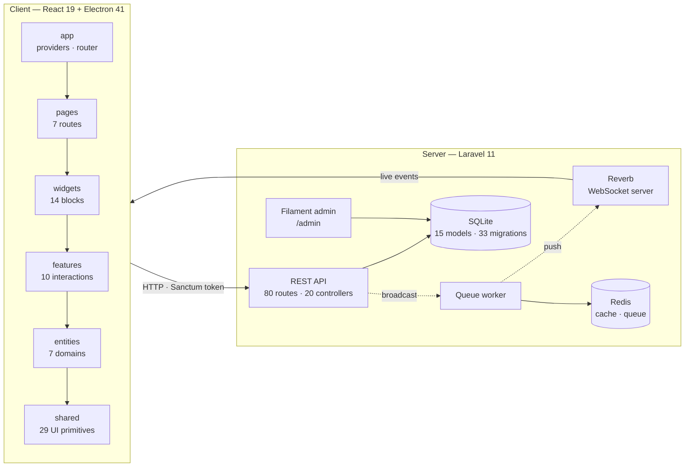

<div align="center">



<br>

[](LICENSE)
[](https://react.dev)
[](https://laravel.com)
[](https://www.electronjs.org)
[](https://www.typescriptlang.org)
[](https://www.docker.com)

**Kanban boards, sprints and real-time team chat — on your own infrastructure.**
Runs as a native desktop app or in any browser. No seats, no SaaS, no vendor lock-in.

<br>

[**Quick start**](#-quick-start) · [**Features**](#-features) · [**Screenshots**](#-screenshots) · [**Architecture**](#-architecture) · [**Configuration**](#%EF%B8%8F-configuration) · [**Contributing**](#-contributing)

</div>

<br>

---

## 🎬 See it in action

<div align="center">



<sub><b>Board → task detail → channels → direct messages → live accent theming.</b> Recorded against the seeded demo workspace.</sub>

</div>

<br>

---

## 💡 Why Kaiju

Most project trackers are SaaS products that bill per seat and keep your roadmap on somebody else's servers. Kaiju makes the opposite trade-off.

| | |
|---|---|
| 🔒 **Your data, your box** | Self-hosted end to end. Nothing phones home. |
| ⚡ **Actually real-time** | Board moves and chat messages broadcast over WebSockets via Laravel Reverb — no polling. |
| 🗄️ **No database server** | SQLite by default. Redis is optional, and only used for cache and queues under Docker. |
| 🖥️ **Desktop or browser** | The same React app ships as a frameless Electron window or a plain web page. |
| 🎨 **Yours to restyle** | 18 accent colors across 7 base tones, switchable at runtime with no rebuild. |
| 📦 **One command to run** | `docker compose up` brings up the API, WebSocket server, queue worker, Redis and the dev server. |

Built for small teams who want Jira-shaped tracking without the Jira-shaped overhead.

<br>

---

## 📸 Screenshots

<table>
<tr>
<td width="50%" valign="top">

<p align="center"><b>Kanban board</b><br><sub>Columns with WIP limits, priority, tags, assignees and due dates.</sub></p>
</td>
<td width="50%" valign="top">

<p align="center"><b>Task detail</b><br><sub>Assignee, sprint, epic, estimate, threaded comments and attachments.</sub></p>
</td>
</tr>
<tr>
<td width="50%" valign="top">

<p align="center"><b>Channel chat</b><br><sub>Workspace channels with presence and live message delivery.</sub></p>
</td>
<td width="50%" valign="top">

<p align="center"><b>Direct messages</b><br><sub>Private one-to-one threads with read state and attachments.</sub></p>
</td>
</tr>
<tr>
<td width="50%" valign="top">

<p align="center"><b>Appearance</b><br><sub>Light / dark / system, seven base tones, eighteen accents.</sub></p>
</td>
<td width="50%" valign="top">

<p align="center"><b>Profiles</b><br><sub>Avatar, cover, bio, skills and experience per member.</sub></p>
</td>
</tr>
<tr>
<td colspan="2" valign="top">

<p align="center"><b>Global search</b><br><sub>Command palette over tasks, boards and conversations.</sub></p>
</td>
</tr>
</table>

<br>

---

## ✨ Features

<details open>
<summary><b>Project management</b></summary>
<br>

| Feature | What it does |
|---|---|
| ⚡ **Kanban boards** | Drag-and-drop cards across custom columns, with per-column WIP limits and a done column. |
| 🏗️ **Workspaces** | Isolated environments with their own boards, members, channels and tags. |
| 🎯 **Sprints** | Time-boxed iterations in three states — planning, active, completed. |
| 📌 **Epics** | Group related tasks under a colored, workspace-level objective. |
| 🏷️ **Tags** | Free-form labels with custom colors, scoped to a workspace. |
| 📊 **Priorities** | Five tiers from Lowest to Highest, rendered as icons on the card. |
| 💬 **Comments** | A discussion thread on every task. |
| 📎 **Attachments** | Files on tasks and in chat, served through the API. |
| 🔢 **Task keys** | Automatic per-board numbering — `PRODUCT-BOARD-3`, `PRODUCT-BOARD-4`, and so on. |

</details>

<details open>
<summary><b>Team communication</b></summary>
<br>

| Feature | What it does |
|---|---|
| 💬 **Channels** | Workspace-wide rooms with descriptions and ordering; one default channel per workspace. |
| ✉️ **Direct messages** | Private conversations between two members, with local contact names. |
| 🟢 **Presence** | Live online indicator per channel. |
| ✏️ **Edit and delete** | Amend or remove your own messages; edits are flagged. |
| ↩️ **Replies** | Quote-reply to any message in a channel or DM. |
| 🚫 **Blocking** | Block and unblock users across the workspace. |
| 🔔 **Notification preferences** | Per-user control over what generates an alert. |

</details>

<details open>
<summary><b>Platform</b></summary>
<br>

| Feature | What it does |
|---|---|
| 🖥️ **Electron desktop app** | Frameless native window with a custom title bar and window controls. |
| 🌐 **Web mode** | The same build without the Electron plugin — `VITE_WEB_ONLY=true`. |
| 🎨 **Theming** | Light / dark / system, 7 base tones, 18 accents, applied before first paint. |
| 👤 **Profiles** | Avatar, cover image, bio, job title, department, location, skills, experience. |
| 📧 **Email verification** | Signed verification links; unverified users are gated out of the app routes. |
| 🔗 **Invitations** | Direct email invites plus shareable, expiring workspace join links. |
| 🔍 **Global search** | One palette across tasks, boards and conversations. |
| 🛡️ **Roles** | Owner, admin and member, enforced on every workspace route. |
| ⚙️ **Admin panel** | Filament 3 backend at `/admin`. |

</details>

<br>

---

## 🛠 Tech stack

<table>
<tr>
<td><b>Frontend</b></td>
<td>


</td>
</tr>
<tr>
<td><b>State &amp; data</b></td>
<td>


</td>
</tr>
<tr>
<td><b>Backend</b></td>
<td>


</td>
</tr>
<tr>
<td><b>Real-time</b></td>
<td>


</td>
</tr>
<tr>
<td><b>Desktop &amp; infra</b></td>
<td>


</td>
</tr>
<tr>
<td><b>Quality</b></td>
<td>


</td>
</tr>
</table>

<br>

---

## 🏗 Architecture

The frontend follows **Feature-Sliced Design**. The backend is a conventional **Laravel API** with thin controllers, form requests, DTOs, action classes and API resources.



### Frontend layers

| Layer | Path | Responsibility |
|---|---|---|
| `app` | `frontend/src/app/` | Providers (query, theme, realtime) and the router. |
| `pages` | `frontend/src/pages/` | Route components: auth, board, chat, profile, settings, workspace, invite-accept. |
| `widgets` | `frontend/src/widgets/` | Composed blocks: kanban, sidebars, chat panels, task detail, title bar. |
| `features` | `frontend/src/features/` | User actions: create task/board/workspace, invite, search, send message, attachments. |
| `entities` | `frontend/src/entities/` | Domain models and API hooks: board, task, user, workspace, channel, message, conversation. |
| `shared` | `frontend/src/shared/` | UI kit, hooks, API client, config and types. |

### Request lifecycle

```text
Route  ->  Form Request (validation)  ->  DTO  ->  Action (business logic)
                                                      |
                                       Eloquent model +
                                                      |
                                                      +->  Event  ->  Reverb  ->  connected clients
                                          API Resource ->  JSON response
```

<br>

---

## 🚀 Quick start

### Option 1 — Docker Compose (recommended)

```bash
git clone https://github.com/shapikkk/Kaiju.git
cd Kaiju

cp backend/.env.example  backend/.env
cp frontend/.env.example frontend/.env

docker compose up --build -d
```

Then prepare the application once:

```bash
docker compose exec backend php artisan key:generate
docker compose exec backend php artisan reverb:install   # generates REVERB_APP_ID / KEY / SECRET
docker compose exec backend php artisan migrate --seed   # schema + demo workspace
```

> [!NOTE]
> Copy the generated `REVERB_APP_KEY` into `frontend/.env` as `VITE_REVERB_APP_KEY`, then run
> `docker compose restart frontend` so the browser and the server agree on the same app key.

| Service | URL | Container |
|---|---|---|
| Frontend (Vite) | <http://localhost:5173> | `frontend` |
| REST API | <http://localhost:8000> | `backend` |
| Admin panel | <http://localhost:8000/admin> | `backend` |
| WebSocket | `ws://localhost:8080` | `reverb` |
| Queue worker | — | `queue` |
| Redis | `localhost:6379` | `redis` |

<details>
<summary><b>Demo credentials</b> (created by <code>--seed</code>)</summary>
<br>

| User | Email | Password | Role |
|---|---|---|---|
| Alice Johnson | `alice@kaiju.dev` | `password` | Owner |
| Bob Smith | `bob@kaiju.dev` | `password` | Admin |
| Carol Williams | `carol@kaiju.dev` | `password` | Member |

The seeder builds a **Kaiju Labs** workspace with a populated board, a sprint, epics, tags and comments.

</details>

### Option 2 — Local development

```bash
# Backend
cd backend
cp .env.example .env
composer install
php artisan key:generate
php artisan reverb:install
php artisan migrate --seed

php artisan serve            # :8000
php artisan reverb:start     # :8080   (second terminal)
php artisan queue:work       #         (third terminal)

# Frontend
cd ../frontend
cp .env.example .env
yarn install
yarn dev                     # :5173
```

### Option 3 — Electron desktop

```bash
cd frontend
yarn electron:dev            # vite build + electron .
```

<br>

---

## ⚙️ Configuration

<details open>
<summary><b>Backend — <code>backend/.env</code></b></summary>
<br>

| Variable | Description | Default |
|---|---|---|
| `APP_URL` | Public URL of the API | `http://localhost:8000` |
| `FRONTEND_URL` | SPA origin, used for CORS and mail links | `http://localhost:5173` |
| `DB_CONNECTION` | Database driver | `sqlite` |
| `BROADCAST_CONNECTION` | Broadcast driver | `reverb` |
| `CACHE_DRIVER` | Cache store | `file` (`redis` under Docker) |
| `QUEUE_CONNECTION` | Queue driver | `sync` (`redis` under Docker) |
| `REVERB_APP_ID` / `REVERB_APP_KEY` / `REVERB_APP_SECRET` | Reverb credentials, from `reverb:install` | — |
| `REVERB_HOST` / `REVERB_PORT` | WebSocket bind address | `localhost` / `8080` |
| `SANCTUM_STATEFUL_DOMAINS` | Domains allowed to use cookie auth | `localhost,localhost:5173,127.0.0.1` |
| `CORS_ALLOWED_ORIGINS` | Allowed SPA origins | `http://localhost:5173` |
| `MAIL_MAILER` / `MAIL_HOST` | Mail transport for verification and invites | `smtp` / Mailtrap sandbox |

</details>

<details open>
<summary><b>Frontend — <code>frontend/.env</code></b></summary>
<br>

| Variable | Description | Default |
|---|---|---|
| `VITE_API_URL` | API base URL | `http://localhost:8000/api` |
| `VITE_REVERB_APP_KEY` | Must match `REVERB_APP_KEY` | — |
| `VITE_REVERB_HOST` | WebSocket host | `localhost` |
| `VITE_REVERB_PORT` | WebSocket port | `8080` |
| `VITE_REVERB_SCHEME` | `http` or `https` | `http` |
| `VITE_WEB_ONLY` | Skip the Electron plugin (set in Docker) | unset |

</details>

<br>

---

## 📁 Project structure

```text
Kaiju/
├── backend/                      # Laravel 11 API
│   ├── app/
│   │   ├── Actions/              # Business logic, one class per operation
│   │   ├── DTOs/                 # Typed payloads between request and action
│   │   ├── Enums/                # Priority · SprintStatus · WorkspaceRole
│   │   ├── Events/               # Broadcast events (board, chat, DM)
│   │   ├── Filament/Resources/   # Admin panel resources
│   │   ├── Http/
│   │   │   ├── Controllers/Api/  # 20 API controllers
│   │   │   ├── Requests/         # Form request validation
│   │   │   └── Resources/        # JSON transformers
│   │   ├── Mail/                 # Invitation and verification mail
│   │   ├── Models/               # 15 Eloquent models
│   │   └── Notifications/
│   ├── database/
│   │   ├── migrations/           # 33 migrations
│   │   └── seeders/DemoSeeder.php
│   └── routes/
│       ├── api.php               # 80 REST routes
│       └── channels.php          # WebSocket channel authorization
│
├── frontend/                     # React 19 + Electron 41
│   ├── electron/                 # Main process and preload
│   ├── public/                   # Icons and logo
│   └── src/
│       ├── app/                  # Providers, router
│       ├── pages/                # 7 route pages
│       ├── widgets/              # 14 composed blocks
│       ├── features/             # 10 user-facing interactions
│       ├── entities/             # 7 domain slices
│       ├── processes/            # Real-time connection lifecycle
│       └── shared/               # UI kit (29 components), hooks, api, config
│
├── docs/                         # README media
└── docker-compose.yml            # redis · backend · reverb · queue · frontend
```

<br>

---

## 🧑‍💻 Development

### Prerequisites

| Tool | Version |
|---|---|
| Node.js | 20+ |
| PHP | 8.2+ |
| Composer | 2.x |
| Yarn | 1.x |
| Docker | any recent release (optional) |

### Commands

<table>
<tr><th align="left">Frontend</th><th align="left">Backend</th></tr>
<tr valign="top">
<td>

```bash
yarn dev            # Vite dev server
yarn build          # tsc -b + production build
yarn preview        # serve the build
yarn lint           # ESLint, incl. FSD rules
yarn format         # Prettier
yarn typecheck      # tsc --noEmit
yarn electron:dev   # build + launch Electron
```

</td>
<td>

```bash
php artisan serve             # API server
php artisan reverb:start      # WebSocket server
php artisan queue:work        # queue worker
php artisan migrate           # run migrations
php artisan migrate:fresh --seed
php artisan pint              # format with Laravel Pint
php artisan test              # PHPUnit 11
```

</td>
</tr>
</table>

> [!TIP]
> The frontend enforces Feature-Sliced Design boundaries through
> [`@conarti/eslint-plugin-feature-sliced`](https://github.com/conarti/eslint-plugin-feature-sliced) —
> `yarn lint` fails if a lower layer imports from a higher one.

<br>

---

## 🗺 Roadmap

<table>
<tr><th align="left" width="50%">✅ Shipped</th><th align="left" width="50%">🚧 Planned</th></tr>
<tr valign="top">
<td>

- [x] Kanban boards with drag-and-drop
- [x] Sprints, epics, tags and priorities
- [x] Task comments and file attachments
- [x] Workspace channels and direct messages
- [x] Presence, message editing and replies
- [x] Invitations and shareable join links
- [x] Email verification
- [x] Role-based workspace access
- [x] Global search palette
- [x] Member profiles with skills and experience
- [x] Theme, base tone and accent customisation
- [x] Electron desktop shell
- [x] Filament admin panel
- [x] Docker Compose environment

</td>
<td>

- [ ] Task activity log and history
- [ ] Board analytics and burndown charts
- [ ] In-app notification centre
- [ ] Markdown in task descriptions
- [ ] Keyboard shortcut cheat sheet
- [ ] Mobile-responsive layout
- [ ] OAuth login (GitHub, Google)
- [ ] Packaged desktop installers
- [ ] Board and workspace export

</td>
</tr>
</table>

<br>

---

## 🤝 Contributing

Contributions are welcome.

1. **Fork** the repository
2. **Branch** — `git checkout -b feature/my-feature`
3. **Build** — keep `yarn lint`, `yarn typecheck` and `php artisan test` green
4. **Commit** — follow [Conventional Commits](https://www.conventionalcommits.org/)
5. **Open a pull request** describing the change and how you verified it

Frontend code must respect the FSD layer order (`app → pages → widgets → features → entities → shared`); backend code is formatted with Laravel Pint.

<br>

---

## 📄 License

Released under the [MIT License](LICENSE). © 2026 [shapikkk](https://github.com/shapikkk)

<br>

## 🙏 Acknowledgements

Kaiju stands on [Laravel](https://laravel.com), [Reverb](https://reverb.laravel.com) and [Filament](https://filamentphp.com) on the server, and on [React](https://react.dev), [Vite](https://vite.dev), [Electron](https://www.electronjs.org), [Tailwind CSS](https://tailwindcss.com), [shadcn/ui](https://ui.shadcn.com), [Radix UI](https://www.radix-ui.com), [TanStack Query](https://tanstack.com/query), [Zustand](https://zustand.docs.pmnd.rs), [dnd kit](https://dndkit.com) and [Lucide](https://lucide.dev) on the client.

<br>

<div align="center">

**If Kaiju is useful to your team, a ⭐ helps other people find it.**

<sub>Made with ❤️ by <a href="https://github.com/shapikkk">shapikkk</a></sub>

</div>
